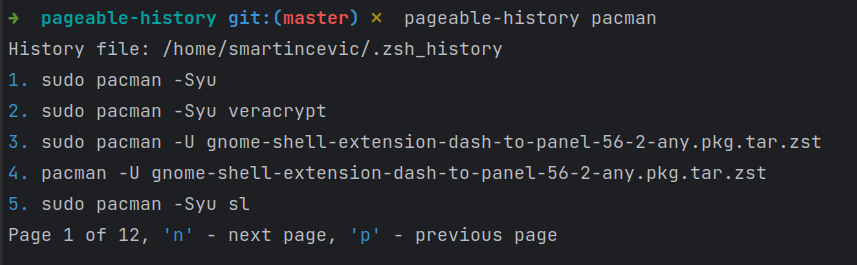

# Simple pageable history
Example use: `pageable-history keyword1 keyword2`.
It will find all distinct commands in history containing all keywords and copies result to clipboard.
- Currently works in `zsh` and `bash`



## Example setup: 
### ZSH

In `.zshrc` paste:
```shell
# skips inserting commands with whitespace to history
setopt HIST_IGNORE_SPACE

# function that will read line from terminal, prepend it with ` pageable-history` and execute command
function _pgh_search() {
  BUFFER=" pageable-history $BUFFER"
  zle accept-line
}

# register function as widget and set keybinding to ALT + R
zle -N _pgh_search
bindkey '\er' _pgh_search
```
This allows typing keywords in zsh and pressing `ALT + R` to instantly call function

### Bash

```shell
export HISTCONTROL=ignorespace

alias pgh=' pageable-history'
```

Example use: `pgh pacman -Syu`